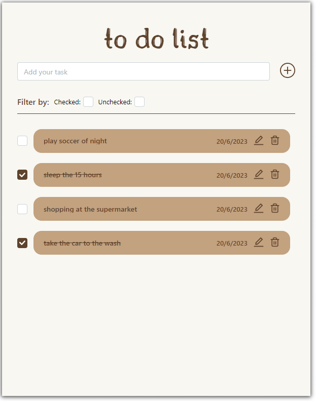
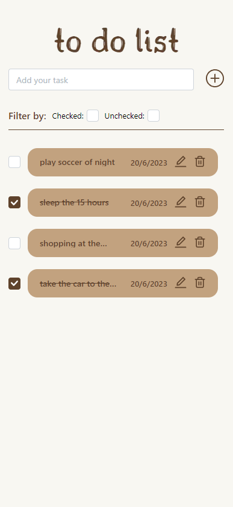

# To Do List

<p align="center">
  <a href="#-technologies">🚀 Technologies</a>&nbsp;&nbsp;&nbsp;|&nbsp;&nbsp;&nbsp;
  <a href="#-project">💻 Project</a>&nbsp;&nbsp;&nbsp;|&nbsp;&nbsp;&nbsp;
  <a href="#-frontend">🌐 Frontend</a>&nbsp;&nbsp;&nbsp;|&nbsp;&nbsp;&nbsp;
  <a href="#-mobile(Responsive)">📱 Mobile</a>&nbsp;&nbsp;&nbsp;|&nbsp;&nbsp;&nbsp;
  <a href="#-how-to-run">🔖How to run</a>&nbsp;&nbsp;&nbsp;|&nbsp;&nbsp;&nbsp;
</p>

<br>

## 🚀 Technologies

This project was developed with the following technologies:

- [TypeScript]()
- [NextJS]()
- [Java]()
- [Springboot]()
- [Docker]()

## 💻 Project
This application consists of a task list, where it stores its tasks in a database and performs all the operations of a simple CRUD.


## 🌐 Frontend
<h1 align="center">
    
</h1>

## 📱 Mobile(Responsive)
<h1 align="center">
    
</h1>

    
## 🔖 How to run

1. Clone the project.

```sh
git clone https://github.com/thinhague/Job_List
```
---
2. You can run the project and database using docker-compose. Each application has its own Dockerfile and docker-compose.yml. 
Then create a network in docker using the command: `docker network create -d bridge todolist_network`.

```sh
docker compose up
```
3. The application will be available at http://localhost:3000
4. Alternatively, you can run the application locally. You will need to have Java 11 and Node.js 18 installed.

## 🔖 Docs
You can find the backend apis documentation at http://localhost:8080/swagger-ui/index.html.

